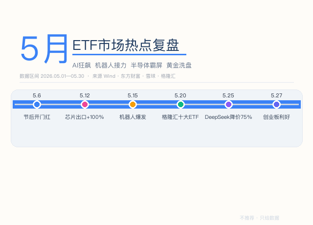
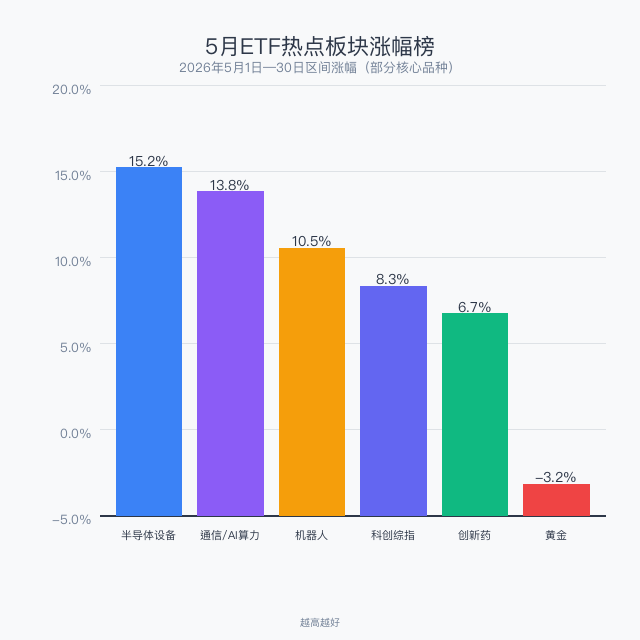
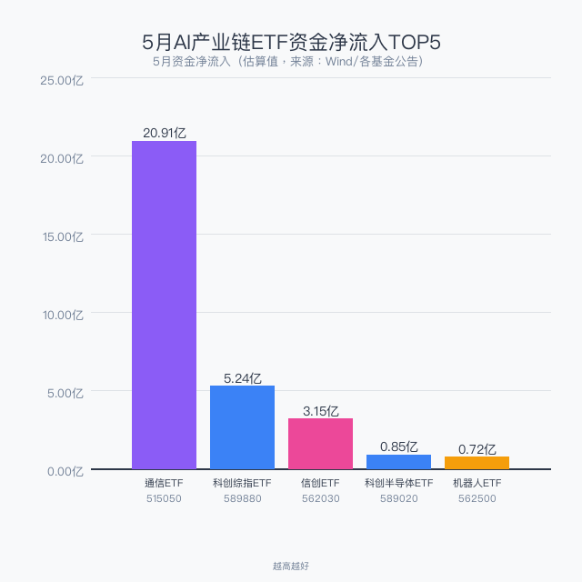
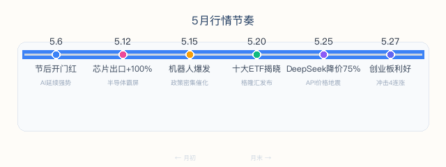

> 数据区间：2026年5月1日—30日
> 数据来源：Wind、东方财富、雪球、格隆汇
> 不推荐任何产品，只梳理事件与数据
> 你选哪个，自己判断

2026年5月，A股ETF市场延续AI主线，同时机器人板块异军突起成为新战力。半导体设备ETF持续霸屏涨幅榜，通信ETF年内涨超60%吸金超20亿。5月25日DeepSeek宣布V4 API降价75%，引发行业地震。黄金ETF在月中经历了深度回调洗盘。本文梳理5月ETF市场的热点事件、关键数据和资金流向。

## 一、5月ETF热点板块涨幅榜

AI硬件产业链（半导体设备、通信算力）继续领跑，机器人板块5月中段爆发，黄金板块受美元反弹和获利回吐影响出现月度负收益。

| 板块 | 5月区间涨幅 | 核心驱动 |
|------|------------|----------|
| 半导体设备 | **+15.2%** | 4月芯片出口+100%创历史新高 |
| 通信/AI算力 | +13.8% | 全球AI算力军备竞赛，云厂商集体涨价 |
| 机器人 | +10.5% | 特斯拉Optimus量产预期+政策密集催化 |
| 科创综指 | +8.3% | 科创板年内涨幅超35% |
| 创新药 | +6.7% | Q1授权交易600亿美元，国产占比75% |
| 黄金 | -3.2% | 美元反弹+前期涨幅过大获利了结 |

## 二、AI产业链ETF资金流向

通信ETF华夏(515050)5月吸金超**20.91亿元**，连续10个交易日净流入，规模增至157亿元。科创综指ETF鹏华(589880)近10日净流入超5亿元。AI算力建设正从"概念炒作"进入"业绩兑现"阶段，资金持续涌入硬件端的逻辑明确。

## 三、5月行情节奏

5月行情呈明显的阶梯式推进，6个关键节点承上启下：

| 日期 | 事件 | 详情 |
|------|------|------|
| 5.6 | 节后开门红 | 机床、机器人、通信ETF领涨 |
| 5.12 | 芯片出口+100% | 海关数据引爆，半导体ETF集体霸屏 |
| 5.15 | 机器人爆发 | 政策催化+量产预期，ETF批量涨超4.5% |
| 5.20 | 格隆汇十大ETF揭晓 | 黄金ETF、科创芯片等入选核心资产 |
| 5.25 | DeepSeek降价75% | API永久降至2.5分/百万Token，行业地震 |
| 5.27 | 创业板政策利好 | 创业板ETF冲击4连涨 |

## 四、DeepSeek V4：5月最重磅的行业地震

5月25日，DeepSeek宣布**V4-Pro API永久降至原价的25%**。缓存命中场景下，每百万Token仅需**2.5分钱**（人民币）——调用一次大模型的成本还不够买一根牙签。对比之下，OpenAI GPT-5.5价格是DeepSeek的数十倍，国内云厂商刚刚完成一轮集体涨价。

资本市场的反应：DeepSeek最新融资目标500亿人民币，投后估值**3500亿人民币（约515亿美元）**。从4月初的100亿美元基准线到5月的515亿美元，4倍估值跃升。

**对ETF市场的影响链**：DeepSeek降价 → AI应用成本骤降 → 应用端爆发 → 算力需求持续增长。直接利好通信ETF、云计算ETF（算力基建），信创ETF（国产芯片适配），机器人ETF（AI赋能加速落地）。

## 五、创新药：低调的暗线

5月创新药板块虽然没有AI那么高调，但产业数据非常扎实：

| 指标 | 数据 |
|------|------|
| 2026Q1 创新药对外授权首付款 | **超33亿美元** |
| 2026Q1 交易总金额 | 突破600亿美元（接近2025全年的50%） |
| 国产创新药交易金额全球占比 | **75%** |
| 2025全年对外授权 | 157笔，总金额1357亿美元 |

这不是"讲故事"，是"卖数据"。中国创新药公司正在把管线卖给全球大药企，首付款和里程碑付款构成实打实的现金流。港股创新药ETF(513120)、恒生医药ETF(159892)在5月持续获得关注。

## 六、黄金ETF：5月过山车

黄金是2025年最牛的大类资产——伦敦金年内涨67%破4400美元。但5月出现了明显的洗盘：

- 5月15日黄金股板块集体深度回调
- 美元阶段性反弹 + 美联储鹰派表态
- 前期涨幅过大，获利盘集中了结

但中长期配置逻辑未变：全球央行持续购金、地缘风险、去美元化趋势。格隆汇连续两年将黄金ETF(518880)纳入"十大核心资产"。

## 七、ETF大赛战报

中邮证券2025年ETF实盘大赛总报名超2.1万人，冠军收益率**87.96%**，投顾产品"邮E投"80次推荐胜率**95%**。2026年1-3月决战赛段已收官。

2026交易员实盘争霸赛截至5月17日：榜一0896账户一骑绝尘，榜二5303从榜十杀至榜二。ETF实盘赛正成为券商获客和激活存量的重要抓手。

## 八、6月前瞻：怎么布局？

| 方向 | 信号强度 | 建议策略 |
|------|---------|----------|
| AI算力链 | ⭐⭐⭐⭐⭐ | 主线延续，回调即机会 |
| 半导体设备 | ⭐⭐⭐⭐⭐ | 出口+100%，国产替代业绩兑现 |
| 机器人 | ⭐⭐⭐⭐ | 高波动，适合定投分批建仓 |
| 创新药 | ⭐⭐⭐⭐ | 关注港股创新药ETF，授权交易持续爆发 |
| 黄金 | ⭐⭐⭐ | 短期承压，中长期逻辑不变 |
| 红利低波 | ⭐⭐⭐ | 半年报窗口，防御配置需求上升 |

---

*数据来源：Wind金融终端、东方财富、雪球、格隆汇、海关总署。*

*本文仅为市场热点梳理，不构成任何投资建议。ETF投资有风险，历史业绩不代表未来表现。*

作者：卡比兽比卡 | 公众号：卡比兽比卡
