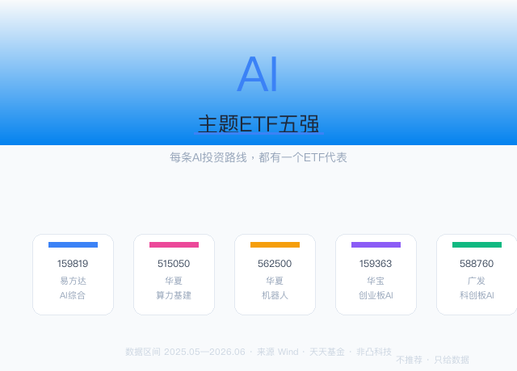
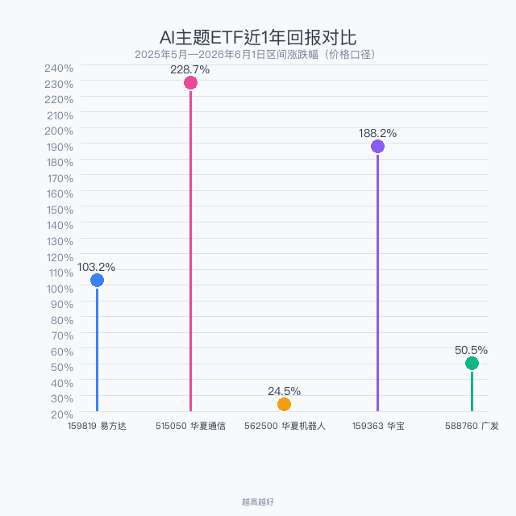
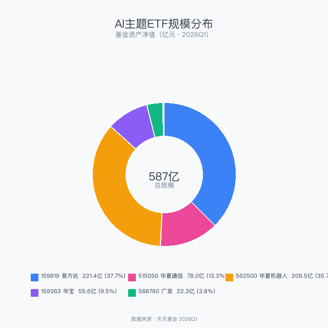
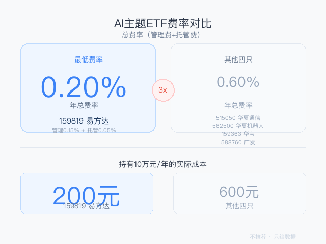

> 数据截止：2026年6月1日
> 数据来源：Wind、天天基金、非凸科技
> 不推荐任何产品，只梳理路线和选手
> 选哪条路，哪个选手，你自己判断

2026年的A股，AI不是"一个板块"——它是一条完整的产业链。上游的通信光模块，中游的AI芯片和算法平台，下游的机器人和智能终端，每个环节都跑出了不同的ETF选手。

本文不按"规模/回报/费率"逐项对比，而是先帮你理清AI投资的三条路线，每条路线配上最有代表性的ETF。看完你知道的不只是"哪个ETF好"，而是"我该押AI链条的哪一段"。

## 一、一张图看懂：五只ETF的AI江湖地位

| 代码 | 简称 | AI环节 | AUM(亿) | 一句话定位 |
|------|------|--------|---------|-----------|
| 159819 | 人工智能ETF易方达 | 全产业链 | **221.41** | AI全家桶，一篮子端走 |
| 515050 | 通信ETF华夏 | 上游——算力基建 | 78.02 | 光模块+服务器，AI卖水人 |
| 562500 | 机器人ETF华夏 | 下游——应用终端 | 209.52 | AI的最终载体 |
| 159363 | 创业板AI ETF华宝 | 创业板AI | 55.64 | 创业板高弹性AI |
| 588760 | 科创AI ETF广发 | 科创板AI | 22.32 | 科创板硬科技AI |

## 二、先看回报：同一赛道，天差地别

过去一年，AI板块内部走出了截然不同的曲线：

**515050通信ETF华夏——228.7%**。AI浪潮最先兑现的环节：无论大模型谁赢，都需要光模块传输数据、服务器部署算力。通信ETF就是那个"不管谁淘到金，卖铲子的稳赚"的故事。

**159363创业板AI——188.2%**。创业板AI公司弹性更足，中小市值在牛市中跑得更快。

**159819综合AI——103.2%**。全产业链配置分散了风险也分散了收益，但翻倍回报仍然可观。

**562500机器人——24.5%**。机器人的爆发还在等一个"iPhone时刻"（人形机器人量产）。现在是播种阶段，不是收获期。

> AI不是铁板一块。选上游（算力）还是下游（应用），过去一年的回报差了近10倍。

## 三、三条AI投资路线

### 路线1：全线押注——AI全家桶

**代表选手：159819 人工智能ETF易方达**

不想选赛道，就想"买下整个AI行业"？159819跟踪中证人工智能主题指数，从芯片到算法到应用一键打包。**关键优势：费率仅0.20%/年**，持有10万一年仅200元。同类产品中最便宜，长期复利优势显著。

221亿AUM，日成交8.57亿，流动性无忧。

### 路线2：上游算力——卖铲子的人

**代表选手：515050 通信ETF华夏**

AI军备竞赛最确定的受益者。无论OpenAI还是DeepSeek赢，光模块、服务器、通信设备的需求都在爆发。515050跟踪中证5G通信指数，核心持仓覆盖光模块龙头（中际旭创、新易盛）和通信设备商。**近1年228.7%的回报就是最好的证明。**

78亿AUM，日成交13.30亿，费率0.60%。

### 路线3：下游应用——等一个iPhone时刻

**代表选手：562500 机器人ETF华夏**

如果说算力是AI的发动机，机器人就是AI的终极载体。210亿AUM说明市场对机器人的长期信心毋庸置疑。但短期回报平淡（近1年仅24.5%），人形机器人量产尚未大规模落地。

## 四、规模和费率的隐藏信息

159819易方达+562500华夏机器人=总规模的74%。

**159819易方达的费率优势是降维打击：** 总费率0.20%，仅其他四只的1/3。

## 五、总结

| | 159819 易方达 | 515050 通信 | 562500 机器人 | 159363 华宝 | 588760 广发 |
|---|-------------|------------|-------------|-----------|-----------|
| 路线 | AI全家桶 | 上游算力 | 下游应用 | 创业板AI | 科创板AI |
| AUM | **221亿** | 78亿 | 210亿 | 56亿 | 22亿 |
| 近1年回报 | 103.2% | **228.7%** | 24.5% | 188.2% | 50.5% |
| 年费率 | **0.20%** | 0.60% | 0.60% | 0.60% | 0.60% |

**最后一个建议：** 如果你对AI产业链的判断是"整体向上"，159819易方达最省心。如果你想主动押注，算力（515050）过去一年回报最高，机器人（562500）可能是未来的最大故事。

---

*数据来源：Wind金融终端、天天基金、非凸科技。*

*本文仅为市场热点梳理，不构成任何投资建议。*

作者：卡比兽比卡 | 公众号：卡比兽比卡
