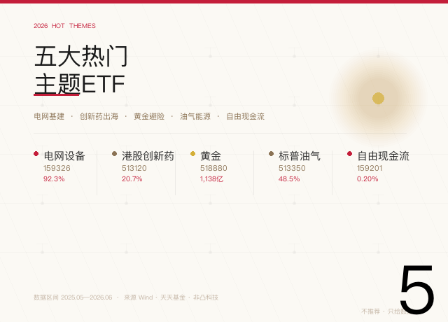
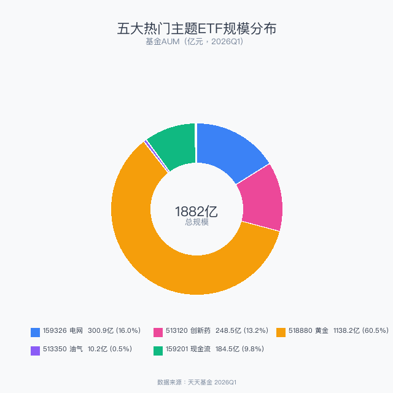
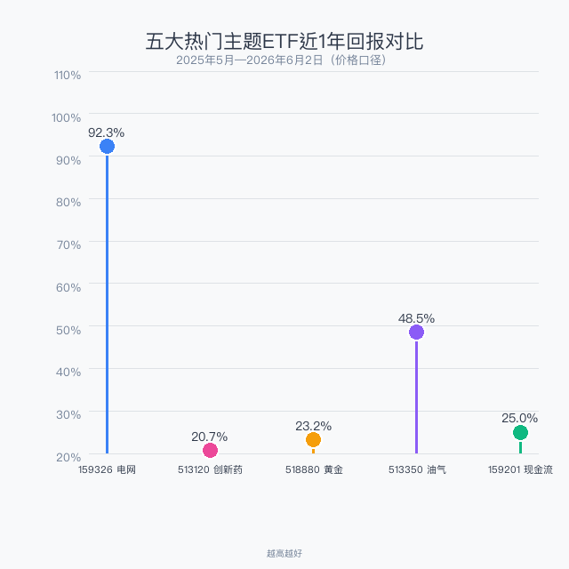

> 数据截止：2026年6月2日
> 数据来源：Wind、天天基金、非凸科技
> 不推荐任何产品，只说清楚每个主题在讲什么故事
> 你信哪个故事，自己决定

2026年的A股不是普涨行情，而是主题轮动的一年。电网基建、创新药出海、黄金避险、油气能源、自由现金流——五个主题，五套完全不同的投资逻辑。本文不是让你在「同主题的5只ETF里挑一只」，而是帮你理清这五个热门主题各自在讲什么故事、有没有道理。

## 一、先看数据

| 代码 | 主题 | AUM(亿) | 近1年回报 | 日成交(亿) |
|------|------|---------|----------|-----------|
| 159326 | 电网设备 | 300.87 | **92.3%** | 8.44 |
| 513120 | 港股创新药 | 248.48 | 20.7% | **27.28** |
| 518880 | 黄金 | **1,138.16** | 23.2% | 13.70 |
| 513350 | 标普油气 | 10.18 | 48.5% | 9.75 |
| 159201 | 自由现金流 | 184.53 | 25.0% | 1.79 |

## 二、规模与回报

黄金ETF（518880）一只就占了五个主题总规模的60%——1138亿是全市场最大的商品ETF，也是机构资产配置的压舱石。

**电网设备以92.3%的近1年回报大幅领跑**——背后是国家电网"十四五"收官年的投资冲刺。标普油气48.5%排第二，受益于中东地缘冲突推高油价。

## 三、五个主题，五个故事

### 1. 电网设备——基建狂魔的超级周期

**159326 电网设备ETF华夏**

2026年是"十四五"电网投资收官年，全年投资预计超6000亿。特高压、配电网改造、新能源消纳——钱砸下去了，设备公司订单排到了后年。从2亿成立规模膨胀到300亿AUM，年内规模增长260亿，全市场ETF增长冠军。近1年回报92.3%。

### 2. 港股创新药——中国医药的出海元年

**513120 港股创新药ETF广发**

2026Q1对外授权交易总金额突破600亿美元，国产占比75%。这不是概念炒作，是有真金白银进来的故事。248亿AUM，日成交27亿。

### 3. 黄金——全球避险的终极选项

**518880 黄金ETF华安**

1138亿AUM说明一切。全球央行持续购金+地缘风险+去美元化趋势。黄金不是"进攻型"资产，它是组合的压舱石和保险单。

### 4. 标普油气——地缘冲突的最大受益者

**513350 标普油气ETF富国**

跟踪S&P油气勘探指数，底层资产是美国上市的油气公司。这是一个典型的事件驱动型主题。10亿AUM规模较小，适合短期博弈。

### 5. 自由现金流——2025年最火新概念

**159201 自由现金流ETF华夏**

2025年2月才成立，一年多膨胀到185亿AUM。策略不是追热点，而是找"赚真钱"的公司：经营现金流减去资本开支后，剩的钱最多的企业。费率仅0.20%，全市场最低档。

## 四、总结

| | 电网 159326 | 创新药 513120 | 黄金 518880 | 油气 513350 | 现金流 159201 |
|---|-----------|------------|-----------|-----------|------------|
| 核心逻辑 | 基建投资 | 出海授权 | 避险+央行购金 | 地缘冲突 | 赚真钱 |
| 波动性 | 中高 | 高 | 低 | 极高 | 中低 |
| AUM | 301亿 | 248亿 | **1,138亿** | 10亿 | 185亿 |
| 近1年回报 | **92.3%** | 20.7% | 23.2% | 48.5% | 25.0% |

**最后一个问题帮你理清思路：** 你当前最担心的是什么？

- 担心错过AI之后的下一波趋势 → **电网设备**
- 担心踏空中国创新药的全球化 → **港股创新药**
- 担心全球乱局和通胀 → **黄金**
- 担心中东局势升级、油价暴涨 → **标普油气**
- 什么都不担心，只想踏踏实实赚钱 → **自由现金流**

---

*数据来源：Wind金融终端、天天基金、非凸科技。*

*本文仅为市场热点梳理，不构成任何投资建议。五个主题完全独立，请根据自身判断独立决策。*

作者：卡比兽比卡 | 公众号：卡比兽比卡
