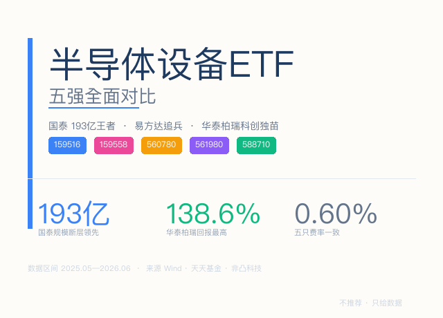
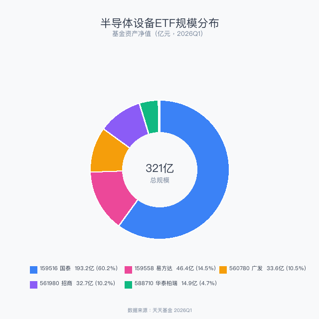
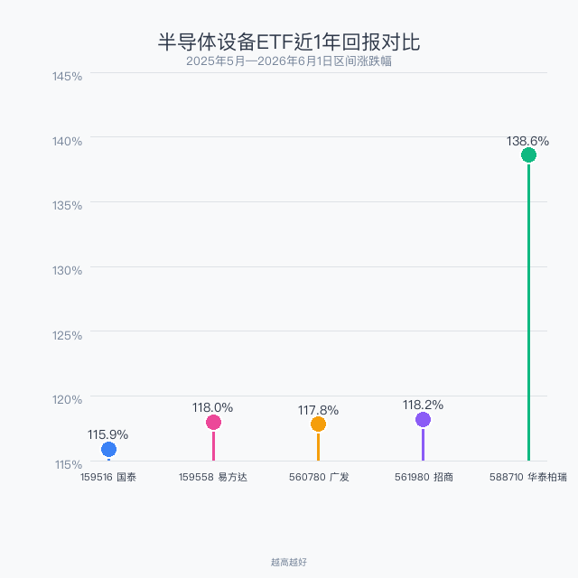
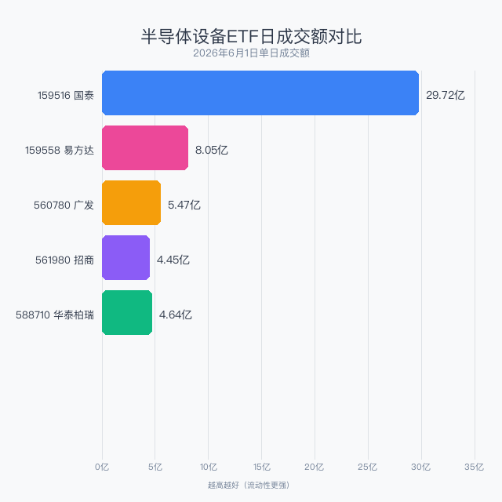
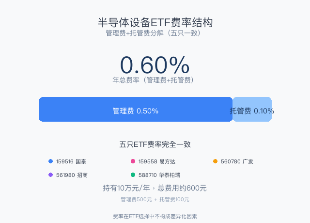

> 数据截止：2026年6月1日
> 数据来源：Wind、天天基金、非凸科技
> 不推荐任何产品，只摆数据
> 你选哪个，自己判断

2026年，半导体设备板块延续史诗级行情——中证半导体材料设备指数近1年涨幅超115%。芯片出口+100%、大基金三期设备突围、国产替代业绩兑现三重逻辑共振。目前全市场8只半导体设备ETF，本文选取规模最大、成交最活跃的5只，从规模、回报、流动性、持仓、费率五个维度做全面对比。

## 一、五只ETF概览

| 代码 | 简称 | 发行人 | 成立日期 | AUM(亿) | 近1年回报 | 跟踪指数 |
|------|------|--------|---------|---------|----------|---------|
| 159516 | 半导体设备ETF国泰 | 国泰基金 | 2023-07-19 | **193.22** | 115.9% | 中证半导体材料设备 |
| 159558 | 半导体设备ETF易方达 | 易方达基金 | 2024-06-06 | 46.40 | 118.0% | 中证半导体材料设备 |
| 560780 | 半导体设备ETF广发 | 广发基金 | 2023-12-01 | 33.61 | 117.8% | 中证半导体材料设备 |
| 561980 | 半导体设备ETF招商 | 招商基金 | 2023-08-21 | 32.73 | 118.2% | 中证半导体产业 |
| 588710 | 科创半导体设备ETF华泰柏瑞 | 华泰柏瑞 | 2025-05-26 | 14.95 | **138.6%** | 科创半导体材料设备 |

> 注：AUM为2026年Q1数据，近1年回报为价格涨跌幅。588710成立仅1年，138.6%为成立至今涨幅。

一眼看出：**国泰159516规模193亿断层领先**，其他四只加一起（127.69亿）还不到它的2/3。但回报最高的却是**华泰柏瑞588710以138.6%夺冠**。

## 二、规模：国泰一骑绝尘

从环形图可以看出，国泰159516一家就占了总规模（321亿）的**60%**。规模龙头的三大优势：流动性更好、跟踪更精准、清盘风险为零。

但规模大不等于收益高。四只跟踪中证半导体材料设备指数的ETF，近1年回报差距不到3个百分点，说明**同指数ETF的收益差异微乎其微**。

## 三、回报：华泰柏瑞科创版更猛

棒棒糖图清晰展示了回报分化：四只主板ETF回报高度一致（115.9%~118.2%），华泰柏瑞588710一骑绝尘（138.6%），高出约20个百分点。原因很简单——它跟踪的是**上证科创板半导体材料设备指数**，成分股全是688开头的科创板公司，弹性更大、波动也更大。

## 四、流动性：国泰日成交30亿碾压

横向柱状图直观展示了流动性断层：159516国泰的29.72亿成交额是第二名易方达（8.05亿）的3.7倍。30亿日成交意味着百万级订单几秒就能成交。

## 五、前十大持仓：同指数ETF高度雷同

| 排名 | 前三只（159516/159558/560780） | 561980招商 | 588710华泰柏瑞 |
|------|------------------------------|-----------|--------------|
| 1 | 康强电子 | 康强电子 | 华兴源创 |
| 2 | 北方华创 | 北方华创 | 中微公司 |
| 3 | 雅克科技 | 雅克科技 | 安集科技 |
| 4 | 中晶科技 | 中晶科技 | 芯源微 |
| 5 | 上海新阳 | 上海新阳 | 拓荆科技 |
| 6 | 南大光电 | 南大光电 | 盛美上海 |
| 7 | 长川科技 | 长川科技 | 金宏气体 |
| 8 | 晶瑞电材 | 晶瑞电材 | 华海清科 |
| 9 | 江丰电子 | 江丰电子 | 沪硅产业 |
| 10 | 广立微 | 联动科技 | 中船特气 |

159516国泰、159558易方达、560780广发三只的前十大持仓**完全一致**。588710华泰柏瑞是唯一的"异类"——前十大全是688科创板公司，与另外四只**零重叠**。

## 六、费率：全员一致，不用纠结

五只ETF费率完全一致：管理费0.50%/年 + 托管费0.10%/年 = 总费率0.60%/年。这是半导体设备类ETF的行业标配。**费率这一项，没有差异化的选择空间。**

持有10万元一年的总费用约600元（管理费500元+托管费100元）。

## 七、总结对比表

| 维度 | 159516 国泰 | 159558 易方达 | 560780 广发 | 561980 招商 | 588710 华泰柏瑞 |
|------|-------------|-------------|-------------|-------------|----------------|
| AUM | **193亿** | 46亿 | 34亿 | 33亿 | 15亿 |
| 近1年回报 | 115.9% | 118.0% | 117.8% | 118.2% | **138.6%** |
| 日成交额 | **29.72亿** | 8.05亿 | 5.47亿 | 4.45亿 | 4.64亿 |
| 总费率 | 0.60% | 0.60% | 0.60% | 0.60% | 0.60% |
| 跟踪指数 | 中证材料设备 | 中证材料设备 | 中证材料设备 | 中证半导体产业 | 科创材料设备 |
| 持仓特点 | 主板+创业板 | 主板+创业板 | 主板+创业板 | 主板+创业板 | 纯科创板 |
| 适合人群 | 大额配置首选 | 稳健跟投 | 常规配置 | 指数差异化 | 高弹性博弈 |

## 八、怎么选？三个场景

**场景一：大资金稳健配置**
选 **159516国泰**。193亿规模、日成交30亿，买卖不费力。这是"睡得着觉"的选择。

**场景二：半导体设备纯多头**
**159516国泰 + 588710华泰柏瑞** 搭配。前者覆盖主板+创业板龙头，后者覆盖科创板高弹性品种，持仓零重叠。

**场景三：博更高弹性的"风偏派"**
选 **588710华泰柏瑞**。科创板半导体，近1年138.6%的回报证明了它的爆发力。但也要注意——涨得快也可能跌得猛。

---

*数据来源：Wind金融终端、天天基金、非凸科技。*

*本文仅为市场热点梳理，不构成任何投资建议。ETF投资有风险，历史业绩不代表未来表现。*

作者：卡比兽比卡 | 公众号：卡比兽比卡
