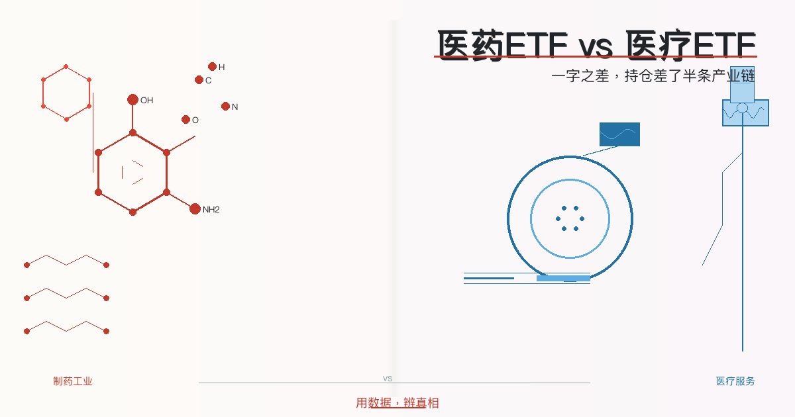
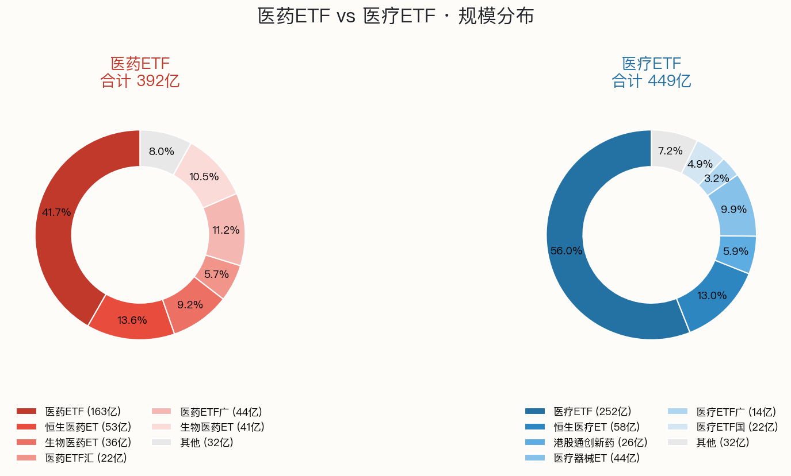
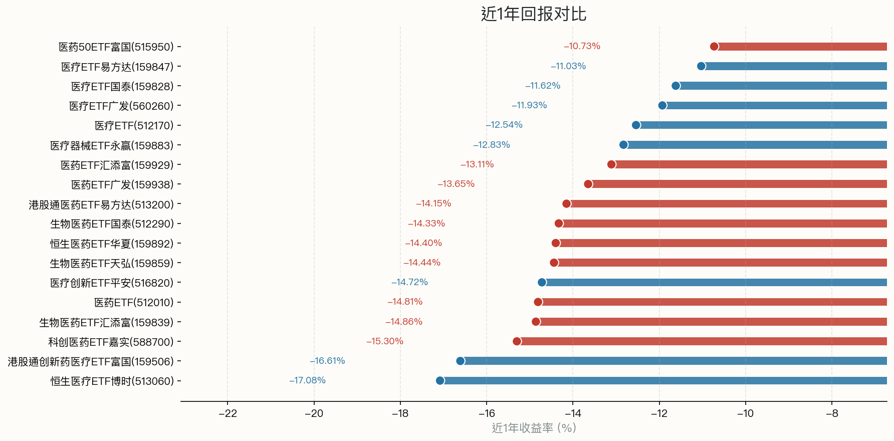
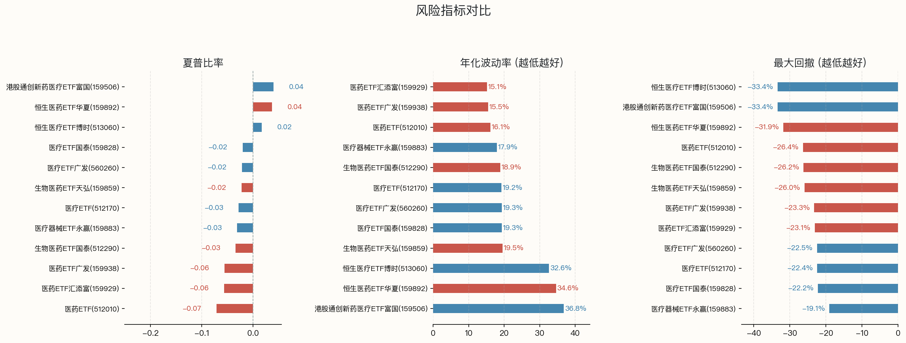
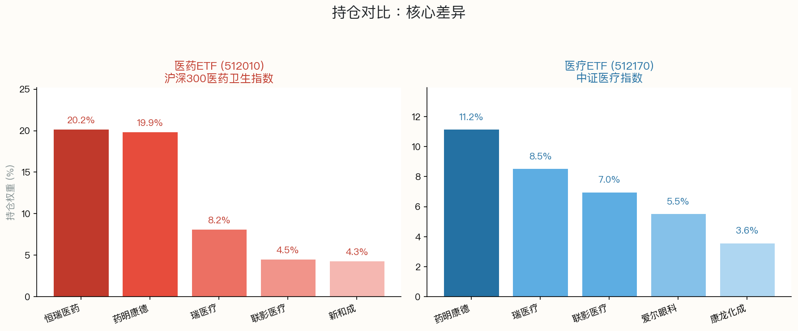
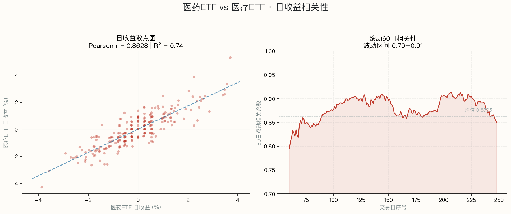

> 同是健康赛道，一个押注制药巨头，一个覆盖全医疗产业链 · **用数据，辨真相**

> 数据区间：2025年6月 — 2026年6月（近1年）
>
> 数据来源：FTShare + WeStock
>
> 免责声明：本文仅提供客观数据对比，不构成投资建议。投资有风险，决策需谨慎。

在A股搜"医药"，**医药ETF** 和 **医疗ETF** 会同时跳出来，名字只差一个字。很多投资者以为它们差不多——都跟健康有关嘛。但持仓一对比，**区别比"药厂"和"医院"还大**。

简单说：**医药ETF是"制药厂股东"，医疗ETF是"整条健康产业链包场"**。一个重仓恒瑞医药（权重超过20%），一个把药明康德、爱尔眼科、康龙化成全装进去。

## 全市场扫描

**医药ETF · 10只（规模≥3亿）**

| 代码 | 名称 | 规模 | 管理人 | 跟踪指数 | 近1年收益 |
|------|------|------|--------|----------|-----------|
| 512010 | **医药ETF** | **163.4亿** | 易方达基金 |  | **-14.8%** |
| 159892 | 恒生医药ETF华夏 | 53.2亿 | 华夏基金 |  | -14.4% |
| 512290 | 生物医药ETF国泰 | 36.1亿 | 国泰基金 |  | -14.3% |
| 159929 | 医药ETF汇添富 | 22.4亿 | 汇添富基金 |  | -13.1% |
| 159938 | 医药ETF广发 | 43.9亿 | 广发基金 |  | -13.7% |
| 159859 | 生物医药ETF天弘 | 41.1亿 | 天弘基金 |  | -14.4% |
| 513200 | 港股通医药ETF易方达 | 12.4亿 | 易方达基金 |  | -14.2% |
| 515950 | 医药50ETF富国 | 5.2亿 | 富国基金 |  | -10.7% |
| 588700 | 科创医药ETF嘉实 | 4.1亿 | 嘉实基金 |  | -15.3% |
| 159839 | 生物医药ETF汇添富 | 9.8亿 | 汇添富基金 |  | -14.9% |

**医疗ETF · 8只（规模≥3亿）**

| 代码 | 名称 | 规模 | 管理人 | 跟踪指数 | 近1年收益 |
|------|------|------|--------|----------|-----------|
| 512170 | **医疗ETF** | **251.6亿** | 华宝基金 |  | **-12.5%** |
| 513060 | 恒生医疗ETF博时 | 58.3亿 | 博时基金 |  | -17.1% |
| 159506 | 港股通创新药医疗ETF富国 | 26.3亿 | 富国基金 |  | -16.6% |
| 159883 | 医疗器械ETF永赢 | 44.5亿 | 永赢基金 |  | -12.8% |
| 560260 | 医疗ETF广发 | 14.5亿 | 广发基金 |  | -11.9% |
| 159828 | 医疗ETF国泰 | 21.8亿 | 国泰基金 |  | -11.6% |
| 516820 | 医疗创新ETF平安 | 17.7亿 | 平安基金 |  | -14.7% |
| 159847 | 医疗ETF易方达 | 14.7亿 | 易方达基金 |  | -11.0% |

医药类10只合计约392亿，医疗类8只合计约449亿。最大单只——**医疗ETF华宝（251.6亿）**超过医药ETF易方达（163.4亿）。

## 一、规模分布

医药类集中在头部：易方达512010占整个医药类的42%，前3名合计占67%。医疗类更加集中：**华宝512170一家独大，占医疗类总规模的56%**。

## 二、业绩表现

近1年医药医疗板块整体承压。A股医药ETF易方达（512010）跌14.8%，医疗ETF华宝（512170）跌12.5%。表现最好的医药50ETF富国(515950)也仅为-10.7%。

医药ETF表现分化严重，因为不同指数成分差异大——沪深300医药重仓恒瑞（20%，股价持续走弱），而港股生物医药受益创新药出海，跌幅相对较浅。

## 三、风险指标

| 指标 | 医药ETF (512010) | 医疗ETF (512170) | 说明 |
|------|:---:|:---:|------|
| **夏普比率** | -0.07 | -0.03 | 两者均偏低 |
| **年化波动率** | 16.1% | 19.2% | 波动水平相当 |
| **最大回撤** | -26.4% | -22.4% | 回撤控制接近 |
| **年化收益(3年)** | -8.7% | -11.9% | 3年维度医药略优 |

风险层面差异不大，波动率相当。**三年维度医药ETF的年化收益略优于医疗ETF**，因为医疗板块集采冲击更严重。

## 四、持仓：核心差异

**医药ETF（512010）前5持仓**：恒瑞医药（20.17%）、药明康德（19.85%）、迈瑞医疗（8.16%）、联影医疗（4.52%）、新和成（4.34%）。前两大占40%。

**医疗ETF（512170）前5持仓**：药明康德（11.15%）、迈瑞医疗（8.53%）、联影医疗（6.98%）、爱尔眼科（5.54%）、康龙化成（3.59%）。前两大占20%。

关键差异三点：

**1. 恒瑞医药**——医药ETF中权重40%，一只恒瑞决定五分之一表现。医疗ETF没有恒瑞。恒瑞近1年走弱直接拖累医药ETF。

**2. 爱尔眼科 + 康龙化成**——这两只在医疗ETF中、不在医药ETF。爱尔是眼科连锁（医疗服务），康龙是CRO（医药研发外包），都属于"医疗"而非"医药制药"。

**3. 集中度**——医药ETF前两大占40%，受单一股票影响大；医疗ETF前两大占20%，风险更分散。两者有重叠（药明康德、迈瑞医疗、联影医疗同时出现）。

## 五、相关性：虽然持仓不同，但高度同涨同跌

近1年（250个交易日）的数学测算：

- **日收益 Pearson 相关系数：0.8628**，属于强正相关
- **R² = 0.7445**：医药ETF 74%的日收益波动可被医疗ETF解释
- **涨跌同向率：79.9%**（249天中199天同涨同跌）
- **60日滚动相关性稳定在 0.79-0.91** 之间，均值 0.8795

这个结果其实不意外。两者同属大健康赛道，**系统性风险（集采政策、医保谈判、行业情绪）是主导因素**，导致大部分时间同涨同跌。剩下约 26% 的独立波动，来自持仓结构的差异——恒瑞医药的单一个股风险、爱尔眼科等服务类标的的不同节奏。

换句话说：**宏观同向，微观不同**。想押注"整个健康行业回暖"，两者差别不大；想精准配置"制药 vs 医疗服务"，则需要看持仓。

## 六、费率

两只代表ETF费率完全一致：**管理费0.5%/年 + 托管费0.1%/年**，总费率0.6%/年。其他同类ETF也基本一致。

## 总结

| 维度 | 医药ETF (512010) | 医疗ETF (512170) |
|------|------|------|
| **一句话定义** | 制药巨头集合 | 全医疗产业链包场 |
| **跟踪指数** | 沪深300医药卫生 | 中证医疗 |
| **核心区别** | 恒瑞权重20%，偏制药 | 含爱尔+康龙，偏服务+器械 |
| **规模** | 163.4亿 | **251.6亿** |
| **近1年收益** | -14.8% | **-12.5%** |
| **3年年化** | **-8.7%** | -11.9% |
| **夏普比率** | -0.07 | **-0.03** |
| **集中度** | 前2占40%，高 | 前2占20%，分散 |
| **日收益相关性** | 互相关系数：**0.86** | 同涨同跌概率：79.9% |
| **费率** | 0.6%/年 | 0.6%/年 |

**看好创新药龙头（恒瑞）和大型制药企业**，医药ETF更匹配；**看好医疗器械国产替代、眼科/牙科等医疗服务增长**，医疗ETF覆盖更全面。两者日收益相关性高达0.86，宏观同向但微观持仓差异明显。

> 数据来源：FTShare, WeStock | 数据截至：2026-06-09
> 本文仅提供客观数据对比，不构成投资建议。投资有风险。
> 
> **用数据，辨真相**
>
> 👉 想自己对比任意两只 ETF？
> 我做了个免费工具：https://froza88.github.io/etf-tool-mvp/