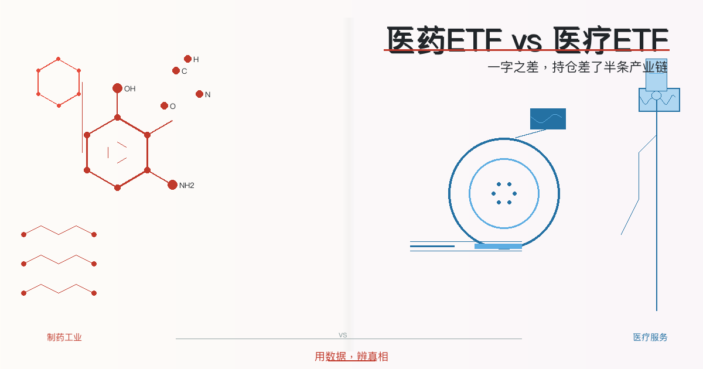
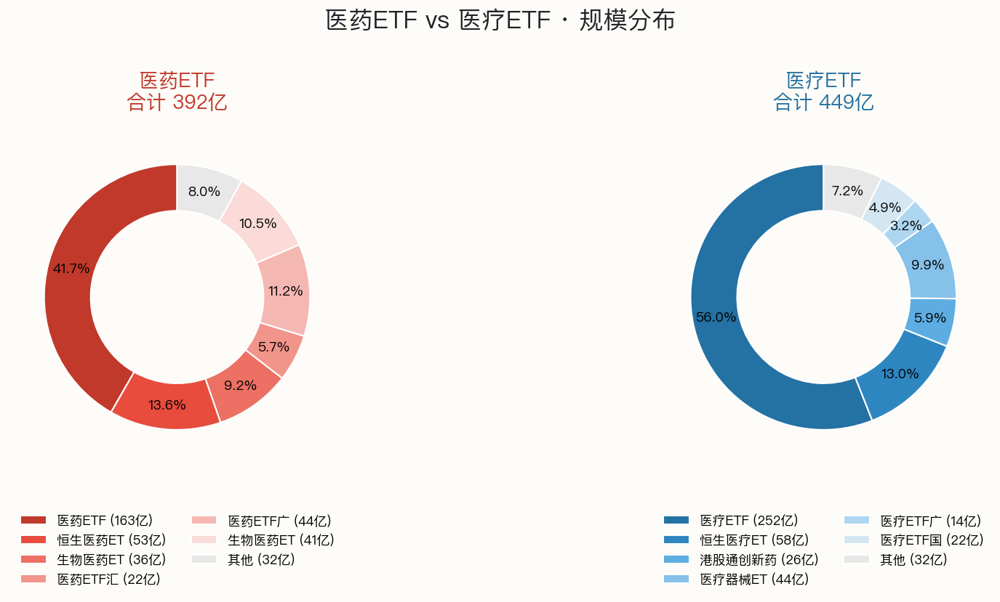
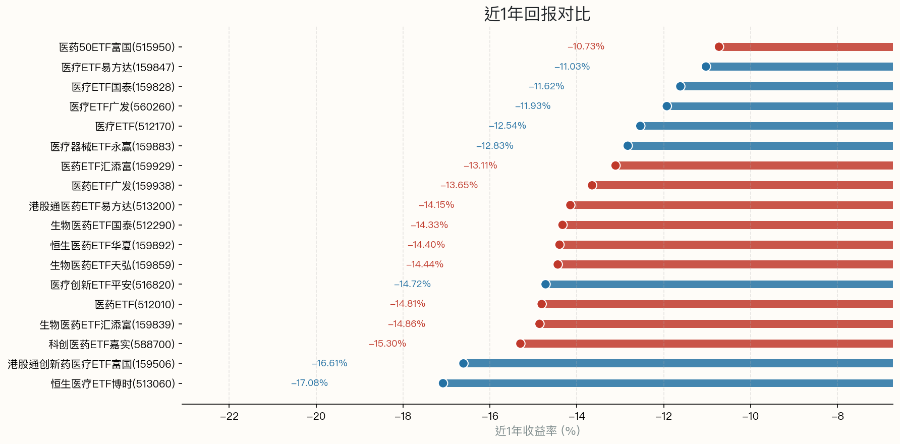
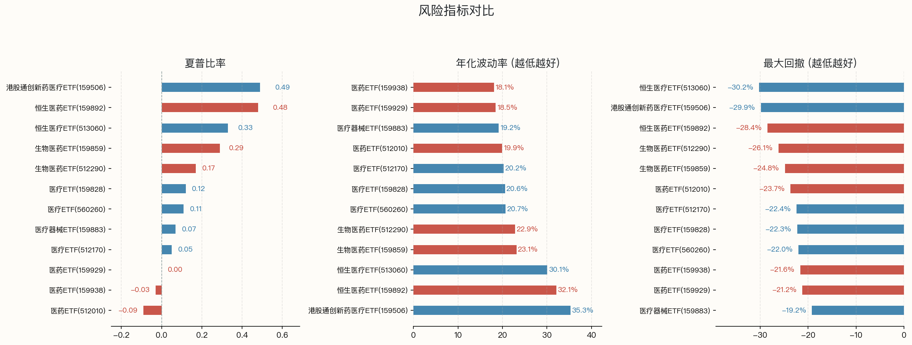
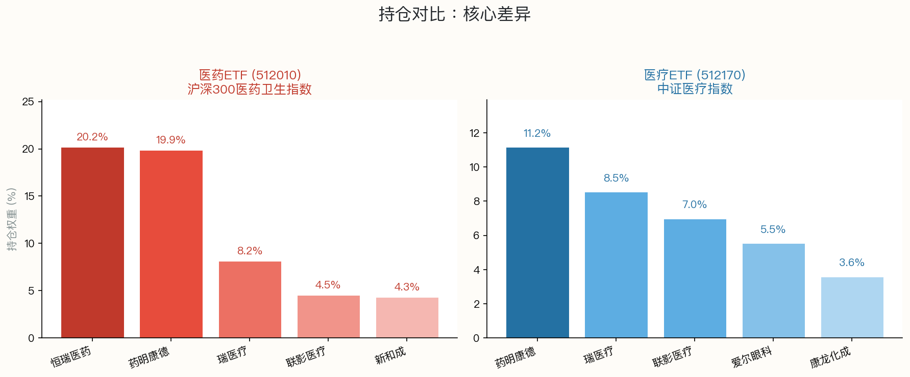
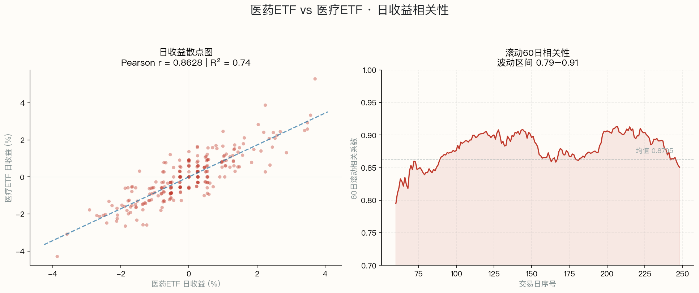

> 数据截止：2026年6月9日 数据来源：FTShare、WeStock 用数据，辨真相

全市场共18只名字含"医药"或"医疗"的ETF，分属两个品种：<b>10只医药ETF</b>（跟踪沪深300医药、中证医药等指数）和<b>8只医疗ETF</b>（跟踪中证医疗指数）。同类ETF之间持仓和费率高度相似，差异主要在规模、流动性和跟踪指数细节。以下先全量对比，再精选代表性产品深挖。

## 全市场医药ETF（10只）：规模分化，跟踪指数有差异

**医药ETF · 10只（规模≥3亿）**

| 代码 | 名称 | 规模 | 管理人 | 跟踪指数 | 近1年收益 |
|------|------|------|--------|----------|-----------|
| 512010 | **医药ETF** | **163.4亿** | 易方达基金 | 沪深300医药卫生 | **-14.8%** |
| 159892 | 恒生医药ETF华夏 | 53.2亿 | 华夏基金 | 恒生香港上市生物科技 | -14.4% |
| 512290 | 生物医药ETF国泰 | 36.1亿 | 国泰基金 | 中证生物医药 | -14.3% |
| 159929 | 医药ETF汇添富 | 22.4亿 | 汇添富基金 | 中证医药卫生 | -13.1% |
| 159938 | 医药ETF广发 | 43.9亿 | 广发基金 | 沪深300医药卫生 | -13.7% |
| 159859 | 生物医药ETF天弘 | 41.1亿 | 天弘基金 | 中证生物医药 | -14.4% |
| 513200 | 港股通医药ETF易方达 | 12.4亿 | 易方达基金 | 港股通医药 | -14.2% |
| 515950 | 医药50ETF富国 | 5.2亿 | 富国基金 | 中证医药50 | -10.7% |
| 588700 | 科创医药ETF嘉实 | 4.1亿 | 嘉实基金 | 科创医药 | -15.3% |
| 159839 | 生物医药ETF汇添富 | 9.8亿 | 汇添富基金 | 中证生物医药 | -14.9% |

> 10只收益率相近但略有分化——跟踪指数不同导致持仓差异。选医药ETF的标准：规模大、成交活跃、跟踪指数符合预期。

## 全市场医疗ETF（8只）：华宝一家独大

**医疗ETF · 8只（规模≥3亿）**

| 代码 | 名称 | 规模 | 管理人 | 跟踪指数 | 近1年收益 |
|------|------|------|--------|----------|-----------|
| 512170 | **医疗ETF** | **251.6亿** | 华宝基金 | 中证医疗 | **-12.5%** |
| 513060 | 恒生医疗ETF博时 | 58.3亿 | 博时基金 | 恒生医疗保健 | -17.1% |
| 159506 | 港股通创新药医疗ETF富国 | 26.3亿 | 富国基金 | 港股通创新药 | -16.6% |
| 159883 | 医疗器械ETF永赢 | 44.5亿 | 永赢基金 | 中证全指医疗器械 | -12.8% |
| 560260 | 医疗ETF广发 | 14.5亿 | 广发基金 | 中证医疗 | -11.9% |
| 159828 | 医疗ETF国泰 | 21.8亿 | 国泰基金 | 中证医疗 | -11.6% |
| 516820 | 医疗创新ETF平安 | 17.7亿 | 平安基金 | 中证医药及医疗器械创新 | -14.7% |
| 159847 | 医疗ETF易方达 | 14.7亿 | 易方达基金 | 中证医疗 | -11.0% |

> 8只收益率和风险指标高度相似（同指数），但规模差距巨大。选医疗ETF的标准：规模大、流动性好（华宝512170断层领先）。

## 深挖之前，先定主角

同类ETF之间差异较小——10只医药ETF核心持仓重叠，8只医疗ETF跟踪同一指数。以下按<b>规模、流动性、数据完整性</b>三项标准，各选一只做深度对比。

<b>医药ETF → 512010 易方达。</b>规模163.4亿（医药类第一）、日成交活跃、运营超10年——数据最完整。

<b>医疗ETF → 512170 华宝。</b>规模251.6亿（医疗类第一，是第二名的两倍多）、日成交38亿、运营超8年——数据完整性最佳。

> 以下是 512010（医药ETF）和 512170（医疗ETF）的深度对比。同类其他产品数据见上方全量表格，不再重复。

## 一、规模分布：医疗ETF是医药ETF的1.5倍

医疗ETF华宝（512170）规模 <b>251.6亿</b>，医药ETF易方达（512010）163.4亿——医疗类总规模（449亿）是医药类（392亿）的1.15倍。医疗ETF华宝一只占医疗类56%，呈现一家独大格局。

## 二、业绩表现：两者都跌，医疗跌幅略浅

医药ETF易方达（512010）近1年跌<b>14.8%</b>，医疗ETF华宝（512170）跌<b>12.5%</b>。医药类跌幅更深，因为恒瑞医药（权重20%）持续走弱直接拖累。医疗类因持仓分散，单一股票影响小，跌幅略浅。

> 两者都在下跌，区别只是"跌多跌少"。医药医疗板块近1年整体承压，集采政策、医保谈判是共同压力。

## 三、风险指标：波动率相当，回撤接近

| 风险指标（近1年） | 医药ETF 512010 | 医疗ETF 512170 |
|------|------|------|
| 年化波动率 | 16.1% | 19.2% |
| 最大回撤 | -26.4% | -22.4% |
| 夏普比率 | -0.07 | -0.03 |
| 3年年化收益 | -8.7% | -11.9% |

医疗ETF波动率高3个百分点，最大回撤浅4个百分点。3年维度医药ETF年化收益略优（-8.7% vs -11.9%），因为医疗板块集采冲击更严重（高值耗材、IVD试剂集采）。

## 四、持仓：核心差异

**医药ETF（512010）前5持仓**：恒瑞医药（20.17%）、药明康德（19.85%）、迈瑞医疗（8.16%）、联影医疗（4.52%）、新和成（4.34%）。前两大占40%。

**医疗ETF（512170）前5持仓**：药明康德（11.15%）、迈瑞医疗（8.53%）、联影医疗（6.98%）、爱尔眼科（5.54%）、康龙化成（3.59%）。前两大占20%。

关键差异三点：

**1. 恒瑞医药**——医药ETF中权重40%，一只恒瑞决定五分之一表现。医疗ETF没有恒瑞。恒瑞近1年走弱直接拖累医药ETF。

**2. 爱尔眼科 + 康龙化成**——这两只在医疗ETF中、不在医药ETF。爱尔是眼科连锁（医疗服务），康龙是CRO（医药研发外包），都属于"医疗"而非"医药制药"。

**3. 集中度**——医药ETF前两大占40%，受单一股票影响大；医疗ETF前两大占20%，风险更分散。两者有重叠（药明康德、迈瑞医疗、联影医疗同时出现）。

## 五、相关性：虽然持仓不同，但高度同涨同跌

近1年（250个交易日）的数学测算：

- **日收益 Pearson 相关系数：0.8628**，属于强正相关
- **R² = 0.7445**：医药ETF 74%的日收益波动可被医疗ETF解释
- **涨跌同向率：79.9%**（249天中199天同涨同跌）
- **60日滚动相关性稳定在 0.79-0.91** 之间，均值 0.8795

这个结果其实不意外。两者同属大健康赛道，**系统性风险（集采政策、医保谈判、行业情绪）是主导因素**，导致大部分时间同涨同跌。剩下约 26% 的独立波动，来自持仓结构的差异——恒瑞医药的单一个股风险、爱尔眼科等服务类标的的不同节奏。

换句话说：**宏观同向，微观不同**。想押注"整个健康行业回暖"，两者差别不大；想精准配置"制药 vs 医疗服务"，则需要看持仓。

## 六、费率

两只代表ETF费率完全一致：**管理费0.5%/年 + 托管费0.1%/年**，总费率0.6%/年。其他同类ETF也基本一致。

## 总结

| 维度 | 医药ETF (512010) | 医疗ETF (512170) |
|------|------|------|
| **一句话定义** | 制药巨头集合 | 全医疗产业链包场 |
| **跟踪指数** | 沪深300医药卫生 | 中证医疗 |
| **核心区别** | 恒瑞权重20%，偏制药 | 含爱尔+康龙，偏服务+器械 |
| **规模** | 163.4亿 | **251.6亿** |
| **近1年收益** | -14.8% | **-12.5%** |
| **3年年化** | **-8.7%** | -11.9% |
| **夏普比率** | -0.07 | **-0.03** |
| **集中度** | 前2占40%，高 | 前2占20%，分散 |
| **日收益相关性** | 互相关系数：**0.86** | 同涨同跌概率：79.9% |
| **费率** | 0.6%/年 | 0.6%/年 |

**看好创新药龙头（恒瑞）和大型制药企业**，医药ETF更匹配；**看好医疗器械国产替代、眼科/牙科等医疗服务增长**，医疗ETF覆盖更全面。两者日收益相关性高达0.86，宏观同向但微观持仓差异明显。

> 数据来源：FTShare, WeStock | 数据截至：2026-06-09  
> 本文仅提供客观数据对比，不构成投资建议。投资有风险。
> 
> **用数据，辨真相**
> 
> 👉 想自己对比任意两只 ETF？免费工具：https://froza88.github.io/etf-tool-mvp/

作者：卡比兽比卡 | 公众号：卡比兽比卡
