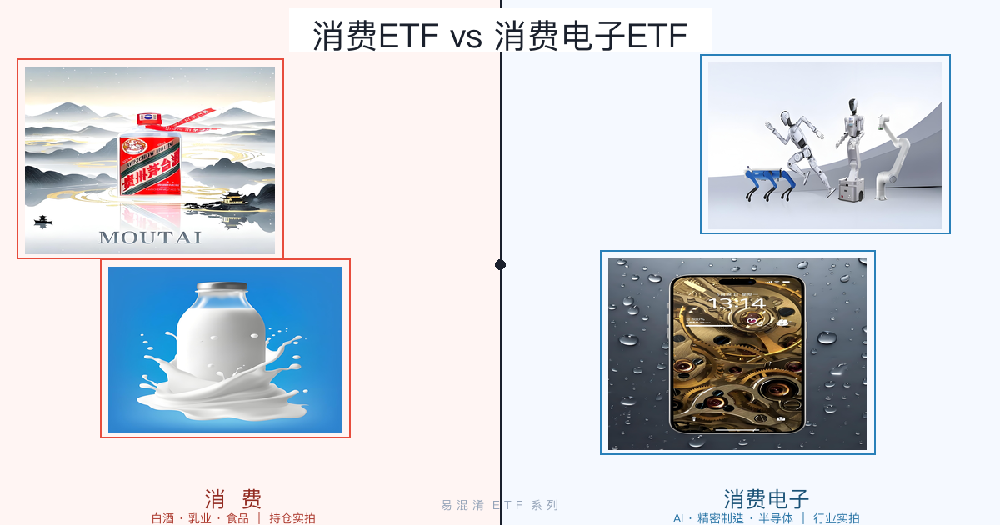
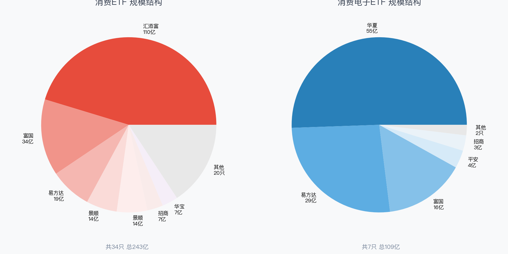
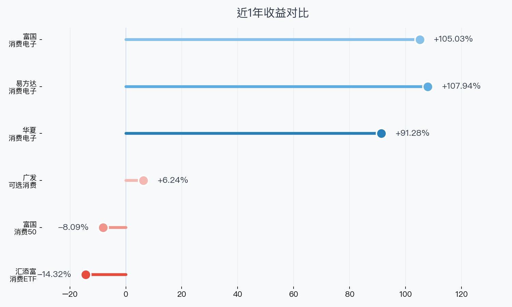
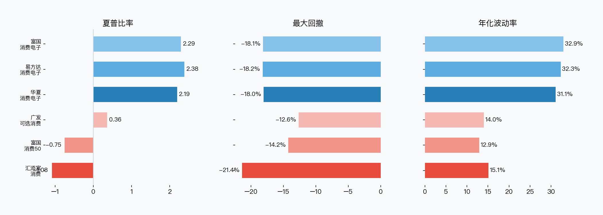
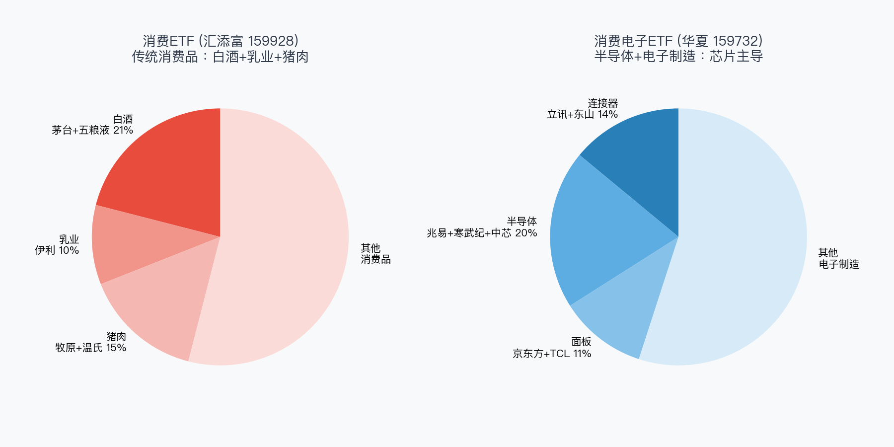

> 数据区间：2025年6月 — 2026年6月（近1年）
> 数据来源：ETF本地数据库（非凸FTShare + WeStock）
> 免责声明：本文仅提供客观数据对比，不构成投资建议。投资有风险，决策需谨慎。

打开炒股软件搜"消费"，你会看到一堆名字高度相似的ETF。但**消费ETF 和 消费电子ETF 持仓截然不同** —— 前者买白酒猪肉，后者买芯片面板。名字里多两个字，风险收益差了十万八千里。

## 全市场扫描

首先做一件必要的事：把市场上所有叫"消费"的ETF都拉出来。

**消费ETF · 34只**

| 代码 | 名称 | 规模 | 管理人 |
|------|------|------|--------|
| 159928 | 消费ETF | **110.1亿** | 汇添富 |
| 515650 | 消费50ETF | 34.3亿 | 富国 |
| 513070 | 港股通消费ETF | 18.7亿 | 易方达 |
| 159529 | 标普消费ETF | 13.8亿 | 景顺 |
| 513970 | 恒生消费ETF | 13.7亿 | 景顺 |
| 510150 | 消费ETF | 7.1亿 | 招商 |
| 516130 | 消费龙头ETF | 7.1亿 | 华宝 |
| 159936 | 可选消费ETF | 4.6亿 | 广发 |
| …… | 其余26只 | 均低于5亿 | |

**消费电子ETF · 7只**

| 代码 | 名称 | 规模 | 管理人 |
|------|------|------|--------|
| 159732 | 消费电子ETF | **55.1亿** | 华夏 |
| 562950 | 消费电子ETF | 28.8亿 | 易方达 |
| 561100 | 消费电子ETF | 16.3亿 | 富国 |
| 561600 | 消费电子ETF | 3.6亿 | 平安 |
| 159779 | 消费电子ETF | 3.1亿 | 招商 |
| 159153 | 消费电子ETF | 1.2亿 | 鹏华 |
| 159178 | 消费电子ETF | 0.9亿 | 汇添富 |

## 一、规模与流动性

消费类ETF市场容量远超消费电子：**34只合计约237亿**，而消费电子类只有7只约109亿。两类最大单只规模：**消费110亿 vs 消费电子55亿**。

## 二、业绩表现：冰火两重天

近1年最大的故事：**消费ETF全线下跌，消费电子ETF全线暴涨**。

- 消费类：汇添富159928跌14.3%，富国515650跌8.1%
- 消费电子类：**易方达562950涨107.9%**，富国561100涨105.0%

消费降级、白酒去库存 vs AI算力爆发、半导体国产替代，两条完全不同的赛道。

## 三、风险指标

消费ETF夏普比率全线为负，消费电子ETF夏普普遍2.2以上，**易方达562950最高达2.38**。但消费电子年化波动31-33%，是消费类两倍多。

## 四、持仓风格：核心差异

**消费ETF（159928）**：茅台、伊利、五粮液、牧原、温氏 —— **白酒+乳业+猪肉**

| 传统消费类持仓逻辑 | 消费电子类持仓逻辑 |
|:---:|:---:|
|  |  |
| 白酒龙头贵州茅台 → 品牌溢价 + 存量竞争 | AI+机器人 → 爆发性增长 + 技术迭代快 |
|  |  |
| 乳业龙头伊利 → 现金流稳定 + 高频复购 | 精密制造/半导体 → 国产替代 + 产业链纵深 |

**消费电子ETF（159732）**：立讯精密、胜宏科技、兆易创新、东山精密、京东方A —— **这里面没有一只消费股，全是电子制造和半导体**

> 如果你以为消费电子ETF买的是苹果、小米——完全搞错了。它买的是这些品牌**背后的零部件供应商**。

## 五、费率

| ETF | 管理费 | 托管费 | 总费率 |
|-----|--------|--------|--------|
| 159928 消费ETF | 0.50% | 0.10% | 0.60% |
| 515650 消费50ETF | 0.50% | 0.10% | 0.60% |
| 159732 消费电子ETF 华夏 | 0.50% | 0.10% | 0.60% |
| 562950 消费电子ETF 易方达 | 0.15% | 0.05% | **0.20%** |
| 561100 消费电子ETF 富国 | 0.50% | 0.10% | 0.60% |

## 总结对比

| 维度 | 159928 消费ETF 汇添富 | 515650 消费50ETF 富国 | 159936 可选消费ETF 广发 | 159732 消费电子ETF 华夏 | 562950 消费电子ETF 易方达 | 561100 消费电子ETF 富国 |
|------|------------|-------------|---------------|---------------|---------------|---------------|
| 规模(亿) | **110.1** | 34.3 | 4.6 | 55.1 | 28.8 | 16.3 |
| 费率 | 0.60% | 0.60% | 0.60% | 0.60% | **0.20%** | 0.60% |
| 1年收益 | -14.32% | -8.09% | 6.24% | 91.28% | **107.94%** | 105.03% |
| 夏普 | -1.08 | -0.75 | 0.36 | 2.19 | **2.38** | 2.29 |
| 最大回撤 | -21.35% | -14.22% | **-12.63%** | -18.03% | -18.19% | -18.12% |
| 持仓 | 白酒+乳业 | 白酒+家电 | 家电+汽车 | 连接器+PCB | 半导体+代工 | 半导体+代工 |

## 选基建议

**看好消费复苏** → 159928 汇添富消费ETF（规模110亿，流动性最好）

**看好AI+芯片** → 562950 易方达消费电子ETF（费率仅0.20%，近1年+108%，费率最低、夏普最高）

**关键提醒**：消费ETF和消费电子ETF不是同类产品，不应互相替代。根据你对"消费"还是"科技"的判断来选择，两者持仓几乎零重叠。

---

数据区间：2025.06 — 2026.06 | 来源：ETF本地数据库（FTShare + WeStock）
作者：卡比兽比卡 | 公众号：卡比兽比卡
