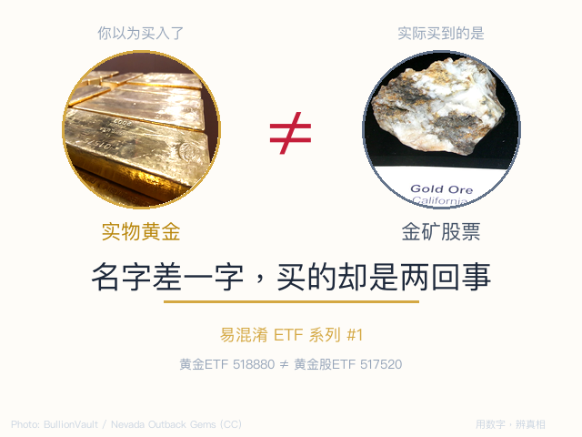
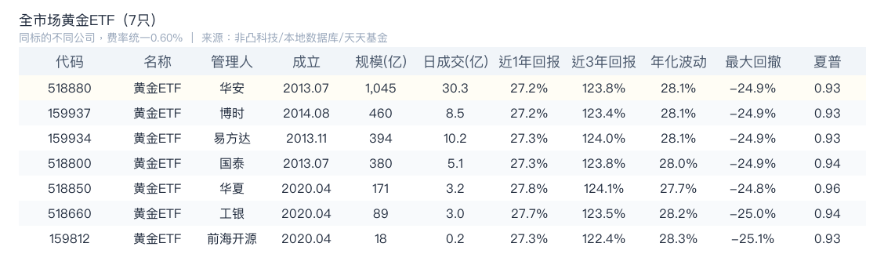
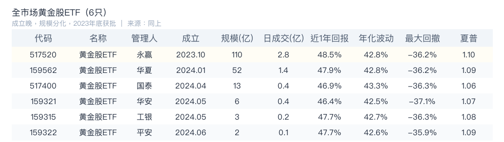
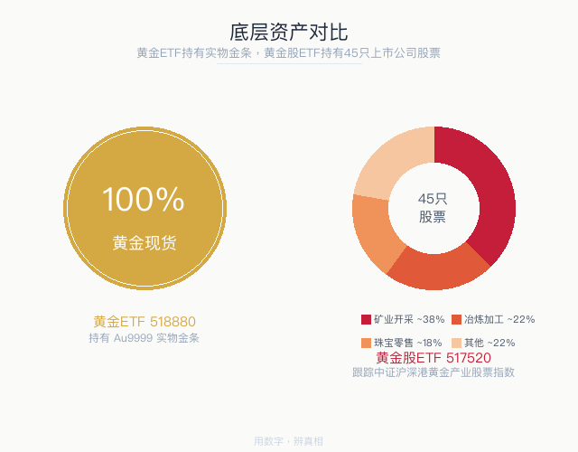
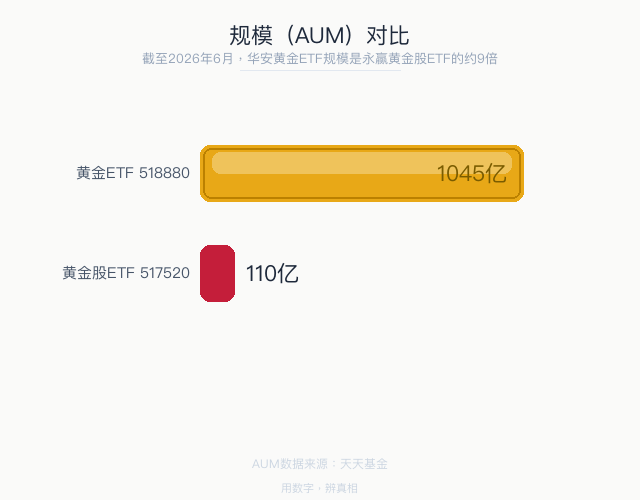
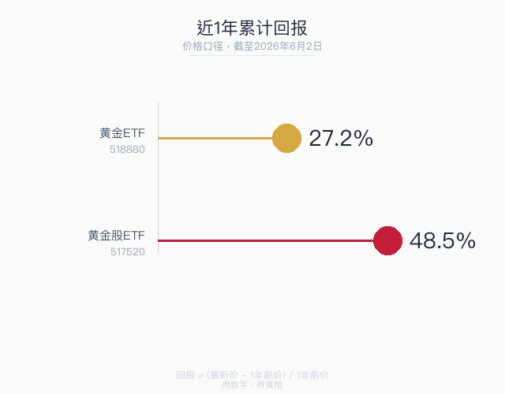
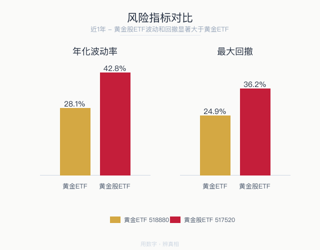

> 数据截止：2026年6月2日 数据来源：非凸科技、Wind、天天基金 用数字，辨真相

全市场共13只名字含"黄金"的ETF，分属两个品种：<b>7只黄金ETF</b>（商品型，跟踪上海金交所 Au9999 黄金现货）和<b>6只黄金股ETF</b>（股票型，跟踪中证沪深港黄金产业股票指数）。同类ETF之间持仓和费率几乎完全相同，差异只在规模、流动性和成立时间。以下先全量对比，再精选代表性产品深挖。

## 全市场黄金ETF（7只）：同标的不同公司

7只全部跟踪 Au9999 现货，持仓100%为实物金条，费率统一为管理费0.50% + 托管费0.10% = <b>0.60%</b>。差异仅在于规模、流动性和成立时间。

> 7只收益率和风险指标几乎一致——它们跟踪同一标的。选黄金ETF的唯一标准：规模大、成交活跃。

## 全市场黄金股ETF（6只）：成立晚，规模分化

6只全部跟踪中证沪深港黄金产业股票指数，持仓高度重叠（45只成分股）。黄金股ETF品类2023年底才获批，全部不到3年，因此没有近3年回报数据。

> 6只收益率和风险指标也高度相似（同指数），但规模和流动性差距巨大。选黄金股ETF的唯一标准同样是：规模大、成立早、数据全。

## 深挖之前，先定主角

同类ETF之间差异极小——7只黄金ETF持仓完全相同，6只黄金股ETF跟踪同一指数。以下按<b>规模、流动性、风险回报数据可比较</b>三项标准，各选一只做深度对比。

<b>黄金ETF → 518880 华安。</b>规模1,045亿（2.3倍于第二）、日成交30亿（3倍于第二）、运营13年——三项断层第一。

<b>黄金股ETF → 517520 永赢。</b>规模110亿（2.1倍于第二）、日成交2.8亿（2倍于第二）、唯一运营超过1年。其余5只成立不足一年，历史数据太短，波动率、回撤、夏普等指标不可比。

> 以下是 518880（黄金ETF）和 517520（黄金股ETF）的深度对比。同类其他产品数据见上方全量表格，不再重复。

## 基本信息

| | 黄金ETF 518880 | 黄金股ETF 517520 |
|------|------|------|
| 全称 | 华安易富黄金ETF | 永赢中证沪深港黄金产业股票ETF |
| 类型 | 商品型 ETF | 股票型 ETF |
| 跟踪标的 | 上海金交所 Au9999 现货 | 中证沪深港黄金产业股票指数 |
| 管理人 | 华安基金 | 永赢基金 |
| 成立时间 | 2013年7月 | 2023年10月 |
| 管理费 | 0.50% | 0.50% |
| 托管费 | 0.10% | 0.10% |

## 你买的是什么？持有资产完全不同

<b>黄金ETF：100% 实物金条。</b>基金公司收到你的钱，在上海金交所买入对应价值的 Au9999 金条，存入金库。你持有的每一份基金份额，背后都是真实存在的黄金。

<b>黄金股ETF：45只金矿公司股票。</b>分散持有金矿开采、冶炼加工、珠宝零售等产业链公司。你的钱买的是公司股权——这些公司的股价受金价影响，但也受经营决策、管理层、股市情绪等多重因素左右。

### 具体持仓对比

| | 黄金ETF 518880 | 黄金股ETF 517520 |
|------|------|------|
| 资产类别 | 实物商品 | 上市公司股票 |
| 持仓数量 | 1 种 | 45 只 |
| 核心持仓 | Au9999 黄金现货（100%），存放于上海金交所金库 | 黄金开采：招金黄金、山金国际、四川黄金、湖南黄金、恒邦股份、铜陵有色；珠宝零售：深中华A、潮宏基、明牌珠宝、周大生、六福集团；冶炼加工：江西铜业、湖南白银；综合矿业：特力A 等 |
| 地域分布 | —（实物存放在境内金库） | A股 + 港股（含六福集团、江西铜业H股等港交所上市公司） |

两种 ETF 的"篮子"里装的东西完全不同——一个装的是金条，一个装的是公司股权证。这是所有差异的根源。

## 规模对比：黄金ETF是黄金股ETF的 9 倍

华安黄金ETF规模 <b>1,045亿</b>，永赢黄金股ETF 110亿——两者相差约<b>9倍</b>。全部6只黄金股ETF合计约186亿，不到华安黄金ETF一只的五分之一。两类ETF的市场定位完全不同：黄金ETF是配置型工具，机构和个人都会长期持有；黄金股ETF偏交易型，投资者在金价波动时进出。

## 近1年回报：黄金股ETF 是黄金ETF 的 1.8 倍

黄金股ETF回报（<b>48.5%</b>）是黄金ETF（27.2%）的1.8倍。这不是"黄金股ETF更好"——而是金矿公司自带<b>经营杠杆</b>：金价涨10%，矿企利润可能涨30%，股价涨幅就被放大了。

> 反过来也一样：金价跌10%，矿企利润可能跌30%，股价跌得更惨。高回报的来源，也是高风险的来源。

## 承担的风险：黄金股ETF波动更大、回撤更深

| 风险指标（近1年） | 黄金ETF 518880 | 黄金股ETF 517520 |
|------|------|------|
| 年化波动率 | 28.1% | 42.8% |
| 最大回撤 | -24.9% | -36.2% |
| 夏普比率 | 0.93 | 1.10 |

黄金股ETF的波动率高出了<b>52%</b>，最大回撤大了<b>11个百分点</b>。夏普比率黄金股ETF略高（1.10 vs 0.93），说明在过去一年金价单边上涨的环境中，黄金股ETF的"每单位风险换来的回报"更高——但这依赖于金价持续上涨的前提。一旦金价回调，这个优势会迅速消失。

## 什么时候用哪个？

<b>如果你担心通胀、货币贬值、地缘风险——选黄金ETF。</b>它跟金价完全联动，跟股市走势几乎无关。7只产品跟踪同一标的，选规模大、流动性好的（如上表，华安518880断层领先）。运营13年，T+0交易，流动性无忧。

<b>如果你看好金价持续上涨，且愿意承担更高波动——考虑黄金股ETF。</b>它通过金矿公司的经营杠杆放大金价涨幅。6只产品持仓几乎一样，选规模大、成立早的（永赢517520或华夏159562）。但务必清楚：金价横盘时金矿股可能跑输，熊市里黄金股跌幅远超金价跌幅。

> 一个检查方法：打开账户里那只"黄金ETF"，看一眼全称。如果全称里有"黄金产业股票"几个字，你买的不是黄金本身，是金矿公司。

---

数据来源：非凸科技（行情/规模）、本地数据库（回报/波动/回撤/夏普）、天天基金（费率/成立日期）。
本文仅为市场知识梳理，不构成任何投资建议。

作者：卡比兽比卡 | 公众号：卡比兽比卡
