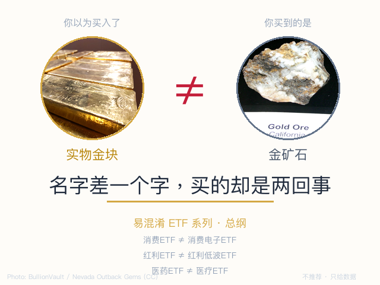

> 全市场 1,500+ 只 ETF，名字相似的比比皆是。
> 本文是系列总纲，帮你建立识别框架。每对易混淆ETF会有独立文章深挖。

## 一个常见场景

你听说"黄金最近涨得不错"，打开交易软件搜"黄金"，出来一串 ETF。你选了一个成交量大的买了。过了一周，金价涨了 3%，你的 ETF 涨了 8%。

你心想"运气不错"——但你买的其实是**黄金股 ETF**，跟踪的是金矿公司的股票，不是黄金本身。金价涨的时候它涨得更猛，但金价跌的时候它也摔得更重——金矿公司自带经营杠杆，涨跌幅通常是金价的 1.5-2 倍。

这不是个例。全市场有至少 **20 对**名字高度相似的 ETF，新手买错的概率不低。

## 为什么会搞混？

ETF 的简称没有统一规范。每个基金公司自己取名，关键区别往往藏在**一两个字的差异**里——而这两个字，决定了底层资产、风险特征、甚至投资逻辑的完全不同。

> **ETF 简称 = [主题/市场] + [子赛道] + ETF + [公司]**。其中"子赛道"的那几个字，就是最容易看漏、也最关键的信息。

## 六种常见混淆类型

### 类型一：名字陷阱（最常见）

名字极像，底层资产完全不同。多一个字少一个字，买的是两回事。

| 例子 | A 买的什么 | B 买的什么 |
|------|-----------|-----------|
| 黄金ETF vs 黄金股ETF | 黄金现货 | 金矿公司股票 |
| 消费ETF vs 消费电子ETF | 茅台/五粮液 | 立讯/歌尔 |
| 医药ETF vs 医疗ETF | 制药企业 | 医院/器械 |
| 电力ETF vs 电网设备ETF | 发电厂 | 输变电设备 |

### 类型二：市场错位（高发）

同一主题，在 A股/港股/科创板分别有 ETF，持仓零重叠。

| 例子 | 买错后果 |
|------|---------|
| 创新药ETF vs 港股创新药ETF | A股创新药企业 vs 港股，持仓完全不同 |
| 芯片ETF vs 科创芯片ETF | 全市场芯片 vs 科创板芯片（688开头） |
| 科创AI vs 创业板AI vs 人工智能ETF | 三个市场，三种弹性 |

### 类型三：策略变体（定投党必看）

同一主题，选股策略不同，长期回报可能差很多。

| 例子 | 差异 |
|------|------|
| 红利ETF vs 红利低波ETF | 只选高股息 vs 高股息+低波动双重筛选 |
| 沪深300ETF vs 沪深300增强ETF | 被动复制 vs 基金经理主动优化 |
| 等权ETF vs 市值加权ETF | 小公司话语权相同 vs 大公司说了算 |

### 类型四：宽基迷思（易忽略）

都说自己是"大盘/中盘"，但定义完全不同。

| 例子 | 差异 |
|------|------|
| 沪深300 vs 中证A500 | 纯市值前300 vs ESG+行业均衡选的500 |
| 科创50 vs 科创100 | 前50大 vs 51-150名 |
| 中证500 vs 中证1000 | "中盘" vs "小盘"，但边界模糊 |

### 类型五：跨境问题（进阶）

同一海外指数，不同通道买，费用和时间差天差地别。

| 问题 | 影响 |
|------|------|
| QDII通道 vs 港股通通道 | 额度限制、费率、交易时间都不同 |
| 人民币份额 vs 港币份额 | 汇率风险谁承担 |
| 溢价率 | 同一ETF可能贵5% |

### 类型六：完全同质（不混淆，但纠结）

多只 ETF 跟踪完全相同的指数，持仓一模一样。差异只在规模、费率和流动性。

| 行业 | 同质ETF数 | 怎么选 |
|------|----------|--------|
| 黄金ETF（现货） | 5只 | 选规模最大、成交最活跃的 |
| 银行ETF | ~10只 | 同上 |
| 军工ETF | ~10只 | 同上 |
| 证券ETF | ~10只 | 同上 |

这种情况不用纠结"哪家强"——没区别。选规模大、费率低的就行。

## 三秒自检法

下单前，花三秒做这三件事：

1. **看一眼全称。** 不要只看简称。打开基金详情页，读全称。如果全称里有"产业股票"四个字，你买的不是那个东西本身，是相关公司的股票。
2. **看一眼跟踪标的。** 是跟踪Au9999（黄金现货），还是跟踪"中证××产业股票指数"？前者买的是实物，后者买的是公司。
3. **看一眼持仓。** 前十大持仓是什么？如果和你想象的不一样，停下来。

## 这个系列会写什么

| # | 类型 | 标题 | 状态 |
|---|------|------|------|
| 1 | 名字陷阱 | 黄金ETF vs 黄金股ETF | 已发布 |
| 2 | 名字陷阱 | 消费ETF vs 消费电子ETF | 待写 |
| 3 | 市场错位 | 创新药ETF vs 港股创新药ETF | 待写 |
| 4 | 策略变体 | 红利ETF vs 红利低波ETF | 待写 |
| 5 | 宽基迷思 | 沪深300 vs 中证A500 | 待写 |
| 6 | — | …… | |

**每篇独立成文，不依赖前文。你可以从任何一篇开始读。**

---

数据来源：Wind金融终端、天天基金、非凸科技。
本文仅为市场知识梳理，不构成任何投资建议。

作者：卡比兽比卡 | 公众号：卡比兽比卡
